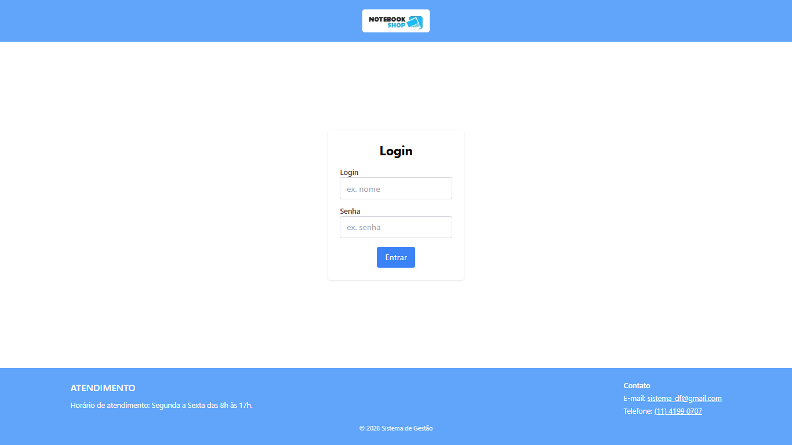
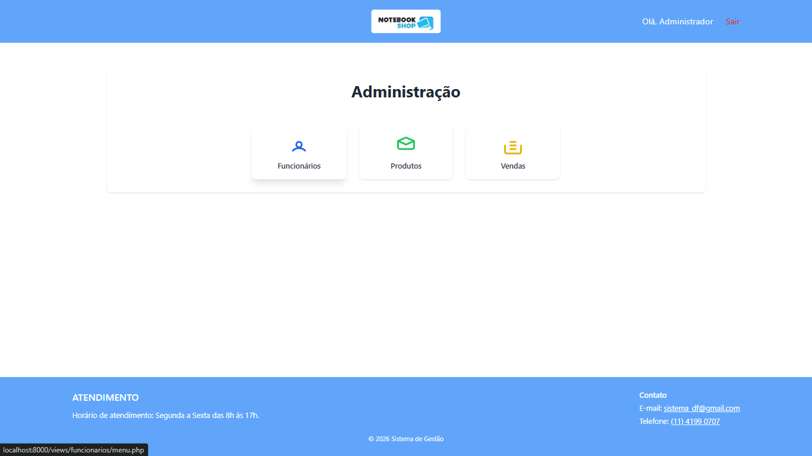
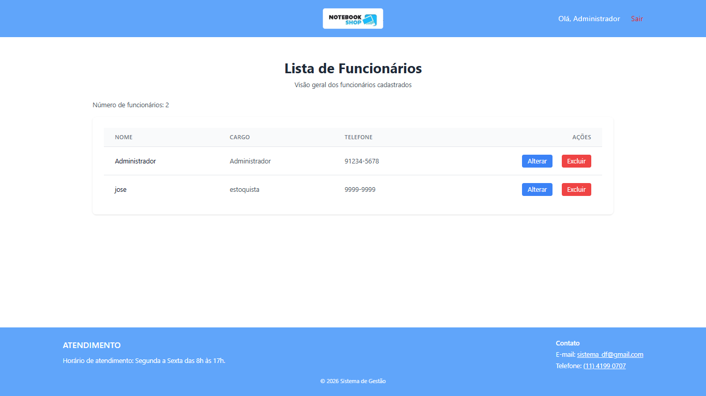
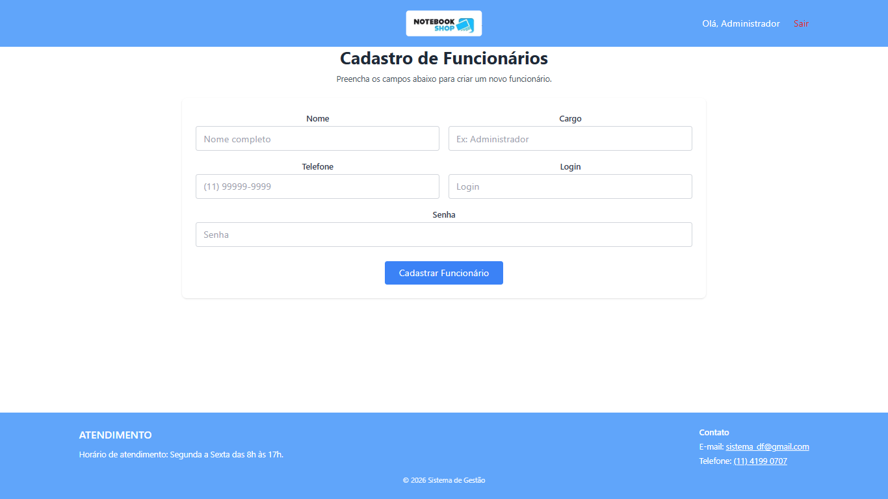
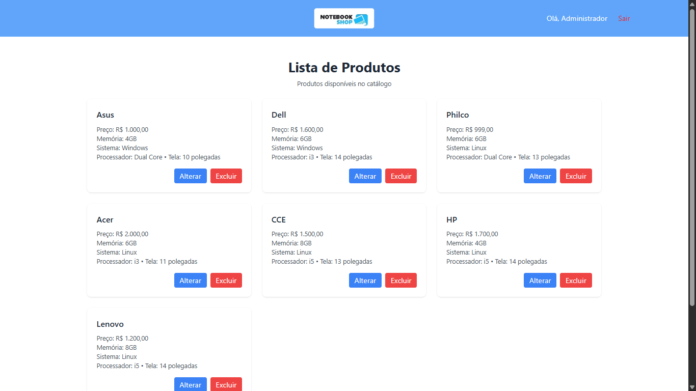
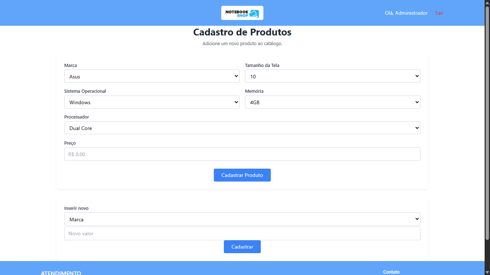
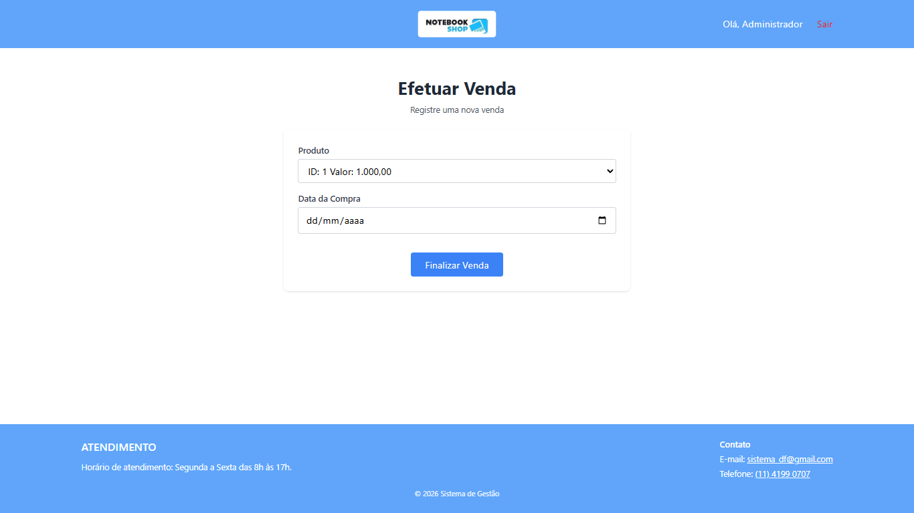
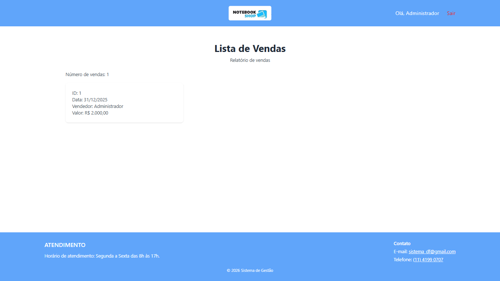

# Sistema de Gestão - Notebooks 📝

## Descrição

Aplicação web em PHP para gerenciar funcionários, produtos e vendas de um pequeno negócio, com operações básicas de CRUD e interface simples.

## Problema que o projeto resolve

Organizar e automatizar tarefas administrativas que normalmente são feitas manualmente em planilhas, reduzindo erros e tempo gasto em operações diárias.

## Solução proposta

Fornecer uma aplicação leve, fácil de usar e manter, separando views, lógica de processo e configuração, para facilitar cadastros, edições, exclusões e relatórios básicos.

## Funcionalidades principais

- Cadastro, edição, listagem e exclusão de **Funcionários**, **Produtos** e **Vendas**
- Autenticação simples (login/logout)
- Confirmação de exclusão no frontend
- Feedback via mensagens em sessão (`$_SESSION['flash']`)

## Tecnologias utilizadas

- PHP (procedural)
- MySQL / MariaDB
- HTML, CSS (Tailwind utility classes) e JavaScript

## Arquitetura e decisões técnicas

- Pastas principais: `views/`, `process/`, `config/`, `includes/`, `assets/`.
- Conexão centralizada em `config/database.php` (função `conectar()`).
- Uso de prepared statements em ações que alteram o banco para evitar SQL Injection.
- Padrão PRG (POST-Redirect-GET) para evitar reenvio de formulários.
- Recomendações: adicionar proteção CSRF e controle de permissões para produção.

## Demonstração (prints)

As imagens abaixo estão centralizadas e exibidas com largura controlada (600px) para não ficarem grandes.

  

  

  

  

  

  

  

  

> Observação: o vídeo `assets/demo/video_demonstração.mp4` não foi inserido inline para manter o README leve; se desejar, posso adicionar uma miniatura clicável ou gerar um GIF reduzido.

## Como rodar o projeto

1. Ajuste as credenciais em `config/database.php`.
2. Importe o banco de dados: `mysql -u usuario -p nome_do_banco < assets/bd/bd_notebook.3.0sql`.
3. Inicie o servidor PHP: `php -S localhost:8000 -t .` e acesse `http://localhost:8000/views/funcionarios/lista.php`.

## Aprendizados

- Importância de validação e prepared statements para segurança.
- PRG melhora UX evitando reenvio de formulários.
- Pequenos erros de nomenclatura podem quebrar fluxos — mantenha consistência.

